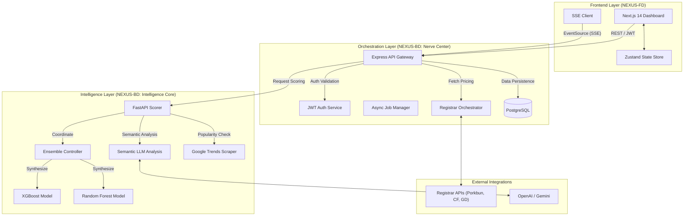
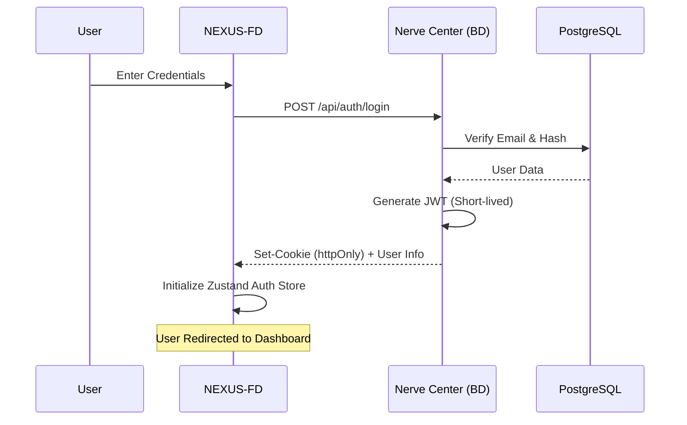
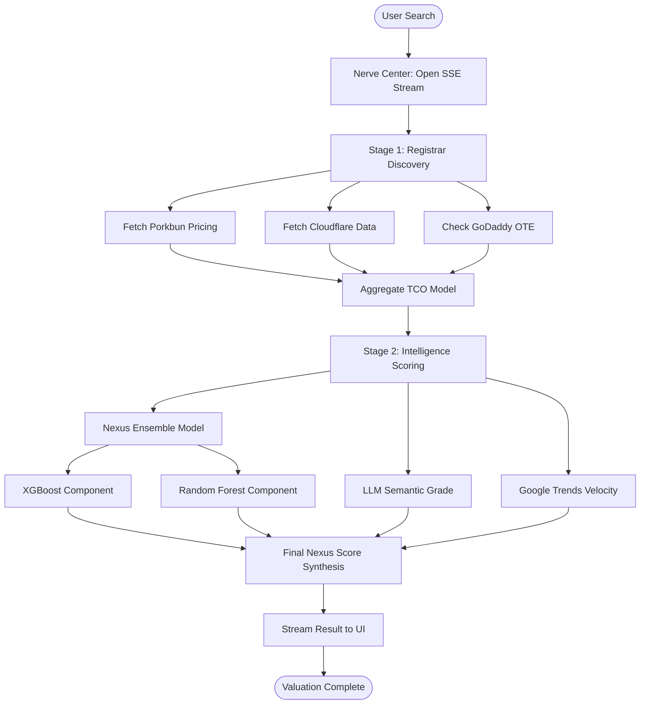
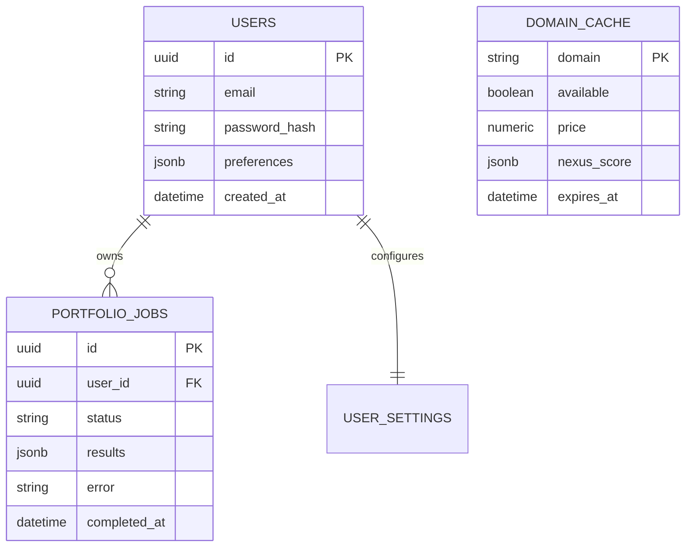

# NEXUS System Documentation 🌐

Welcome to the comprehensive documentation for the **NEXUS Digital Asset Terminal**. This document explains the high-level architecture, core features, and technical workflows that power the platform.

---

## 🏗 High-Level System Architecture

NEXUS is built using a microservices-inspired architecture, separating the user interface, orchestration logic, and machine learning intelligence into three distinct layers.



---

## 🔑 1. Authentication & Security Flow

NEXUS uses a strict institutional-grade authentication flow based on **JSON Web Tokens (JWT)**.

### Flowchart: User Authentication


---

## 📈 2. Domain Valuation Pipeline (Feature: Domain Terminal)

The Domain Terminal utilizes a multi-stage pipeline to synthesize a real-time valuation. This process is streamed to the frontend via **Server-Sent Events (SSE)** to provide instant feedback.

### Flowchart: Valuation Logic


---

## 📂 3. Portfolio Auditor Flow (Feature: Bulk Analysis)

The Auditor allows users to process thousands of domains asynchronously. It uses a background job system to prevent UI blocking.

### Flowchart: Async Job Lifecycle
```mermaid
stateDiagram-v2
    [*] --> Upload: User Uploads CSV
    Upload --> Pending: Nerve Center Creates Job Record
    Pending --> Processing: Job Worker Picks Up Task
    
    state Processing {
        [*] --> Fetching: Multi-Registrar Price Checks
        Fetching --> Scoring: Intelligence Core Valuations
        Scoring --> Aggregating: Synthesize Final Dataset
    }
    
    Processing --> Complete: Job Result Saved to DB
    Processing --> Failed: Error Logged
    
    Complete --> [*]
    Failed --> [*]
    
    note right of Processing
        Frontend polls /api/portfolio/status/:jobId
        every 3 seconds to update progress bars.
    end
```

---

## 🗄 4. Data Model (Entity Relationship)

The core database structure ensures scalability and user-data isolation.



---

## 🛠 Feature-by-Feature Deep Dive

### 1. The Domain Terminal
- **Purpose**: Real-time evaluation of single domains.
- **Key Logic**:
    - **TCO (Total Cost of Ownership)**: Calculates 1-year, 5-year, and 10-year costs across different registrars.
    - **Arbitrage Detection**: Flags if a domain is significantly cheaper at one registrar versus others.
    - **Investment Grade**: Uses a proprietary algorithm to assign grades from **S (Elite)** to **F (Junk)**.

### 2. Portfolio Auditor
- **Purpose**: Bulk valuation and health checks for large portfolios.
- **Capabilities**:
    - Supports CSV uploads up to 10k rows.
    - **Manual Mode**: A real-time editable spreadsheet interface for "live-modelling" portfolios without file uploads.
    - **Auto-Discovery**: For Cloudflare users, it can automatically pull all domains from their account for auditing.

### 3. Nerve Center (Dashboard)
- **Purpose**: High-level financial overview.
- **Metrics**:
    - **Portfolio Net Worth**: Sum of all estimated asset values.
    - **Monthly Burn**: Total renewal costs normalized per month.
    - **TLD Velocity**: Tracking which extensions are trending in the market.

### 4. Settings & Integrations
- **Purpose**: Secure management of API credentials.
- **Registrar Support**:
    - **Porkbun**: Direct API for production pricing.
    - **Cloudflare**: Global API integration for management.
    - **GoDaddy**: OTE (Test) environment integration.

---

## 🤖 Intelligence Core & Model Accuracy

The **Intelligence Core** is the heart of the NEXUS valuation engine. It uses a **Dual-Model Ensemble (XGBoost + Random Forest)** to provide a highly robust quantitative baseline score for any domain.

### Model Performance (Benchmark: May 2026)

The model is evaluated against a curated benchmark dataset of 4,000 domains using a realistic 80/20 train-test split.

- **Overall Closeness Accuracy**: **91.18%**
- **R-squared (Variance Explained)**: **0.59**
- **Trend Correlation**: **0.77** (Strong directional alignment with market prices)

### Accuracy Breakdown by Tier

| Domain Tier | Accuracy | Description |
| :--- | :--- | :--- |
| **High Tier** | **94.8%** | Exceptional at identifying and valuing premium, liquid assets. |
| **Medium Tier** | **71.1%** | Reliable for standard brandable domains and common extensions. |
| **Low Tier** | **65.9%** | Tends to be "optimistic"; current focus of calibration efforts. |

### Running Self-Evaluations

Developers can run a local accuracy audit at any time using the dedicated evaluation suite:
```powershell
cd NEXUS-BD/intelligence-core
python scripts/evaluate_model.py      # Test-only mode
python scripts/train_test_eval.py    # Proper 80/20 split test
```

### Retraining for Production

To update the live model with new data from `data/nexus_domain_india_4000.csv`:
```powershell
cd NEXUS-BD/intelligence-core
python scripts/train_production_model.py
```

---

## 🚀 Performance Optimizations

1. **Domain Caching**: To minimize registrar API costs and latency, successful searches are cached for 24 hours.
2. **SSE Streaming**: Instead of waiting 10 seconds for a full valuation, users see data as it's discovered (Registrar pricing first, then ML score, then Semantic analysis).
3. **Zustand Persistence**: Auth state and dashboard preferences are persisted in `localStorage` to ensure a seamless experience on reload.

---

**NEXUS** — *The future of digital asset management.*
