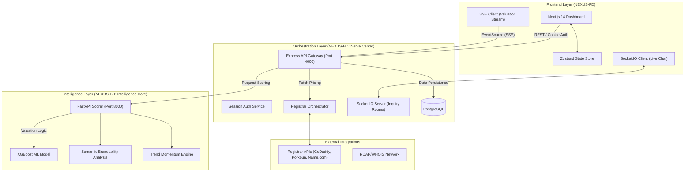
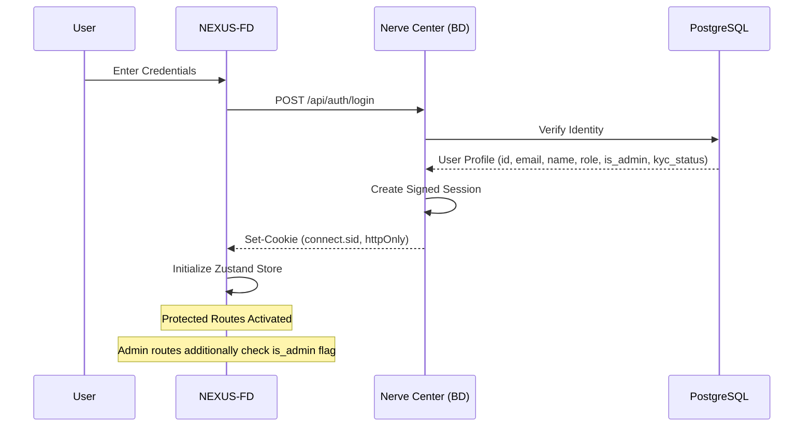
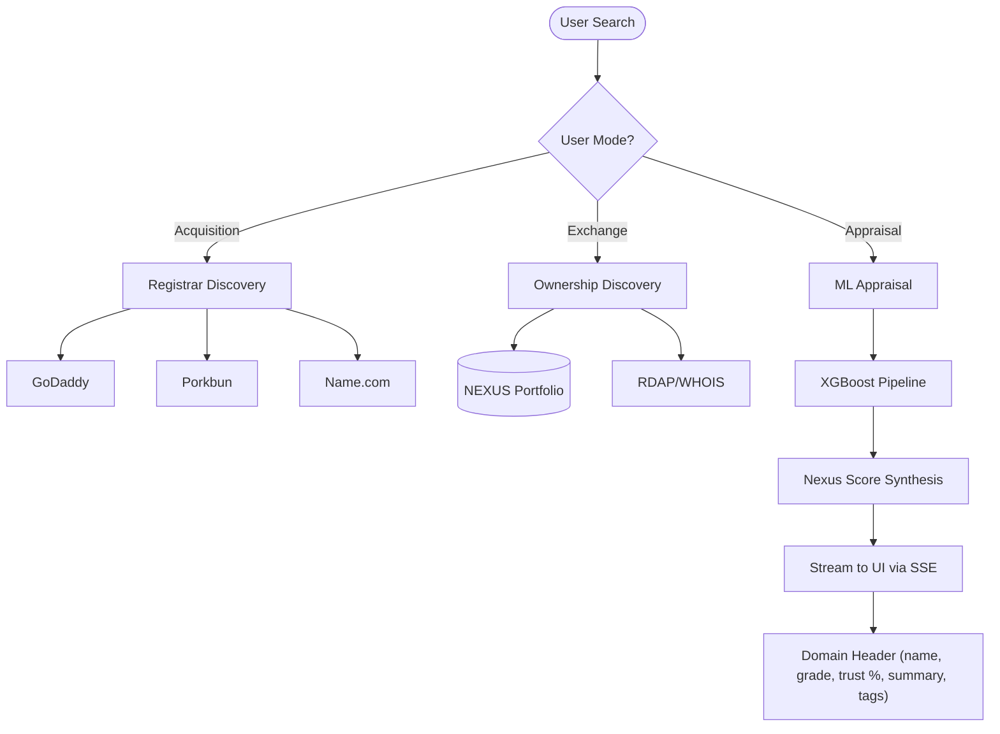
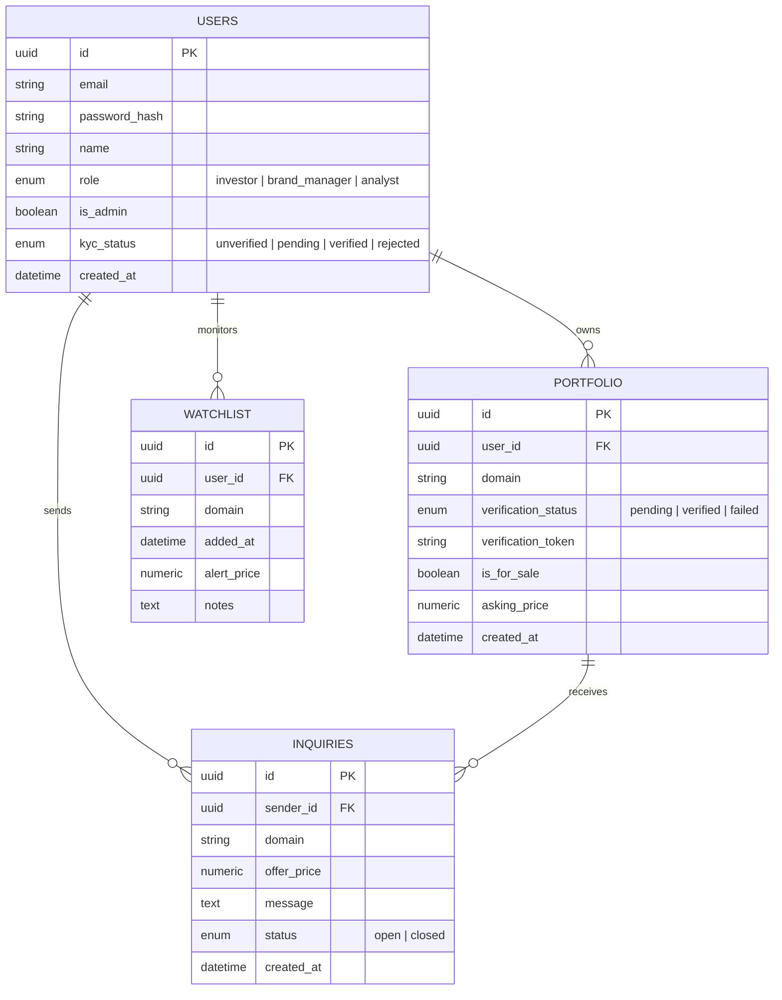

# NEXUS System Documentation 🌐

Master guide for the **NEXUS Digital Asset Terminal**.

---

## 🏗 High-Level System Architecture

NEXUS uses a specialized triple-layer architecture to decouple user experience, business logic, and machine learning intelligence.

> **Note on real-time transports**: SSE is used exclusively for the domain valuation pipeline (one-directional server push). Socket.IO provides the bidirectional channel for live messaging within inquiry threads.

---

## 🔑 1. Authentication & Security Flow

NEXUS implements session-based security using **HttpOnly Cookies**.

### Flowchart: Secure Session Lifecycle

---

## 📈 2. Domain Valuation Pipeline

The Domain Terminal uses a multi-stage pipeline streamed via **Server-Sent Events (SSE)**.

### SSE Progress Phases
Phases are emitted in sequence with a `pct` progress value:

| Phase Label | What Happens |
| :--- | :--- |
| `Scraping Registrars...` | Live pricing fetched from GoDaddy, Porkbun, Name.com |
| `Analyzing Linguistics...` | LLM semantic and brandability scoring |
| `Ownership Analysis...` | RDAP/WHOIS lookup + NEXUS portfolio cross-check |
| `Synthesizing Intelligence...` | Weighted score composition and FMV appraisal |
| `complete` | Full `DomainValuationResponse` emitted on `complete` event |

---

## 🗄 3. Data Model (Entity Relationship)

---

## 🛠 Feature Deep Dive

### 1. The Triple Terminal
- **Acquisition**: Registrar arbitrage table (registration, renewal, transfer, privacy costs per registrar), Scarcity Index gauge, and a primary recommendation block.
- **Appraisal**: Fair Market Value (FMV) and ML-predicted sale price panels, Semantic Score gauge (brand affinity), Velocity gauge (search trend momentum).
- **Exchange**: RDAP/WHOIS ownership snapshot (owner, country, last updated), P2P offer panel for Nexus-member assets, watchlist fallback for external assets, Nexus Trust Index gauge.

### 2. Nerve Center (Dashboard Overview)
Real-time metrics updated every 30 seconds from the Nerve Center API. Each metric includes a `change` percentage shown as a trend indicator:

- **Portfolio Value**: Sum of verified asset appraisals.
- **Active Domains**: Count of technically verified portfolio holdings.
- **Monthly Revenue**: Projected income from active P2P inquiries.
- **Watchlist Size**: Total domains currently being monitored.

### 3. Messages (Communications Hub)
- **Inbox**: Lists all inquiries for the authenticated user — shows domain, counterparty email, offer price, and status.
- **NexusChat**: Real-time Socket.IO thread per inquiry. Messages are fetched via REST on load, then kept live via `join_inquiry` room events.
- **Inquiry Creation**: Launched from the Exchange terminal view via `InquiryModal` — accepts a free-text message and optional offer price (`POST /api/inquiries`).

### 4. Portfolio & Verification
- **Domain Listing**: Add a domain to your portfolio (`POST /api/user/portfolio`).
- **Ownership Proof**: Choose DNS TXT record or HTML meta tag method. The Nerve Center verifies via `dns.resolveTxt` or HTTP crawl.
- **KYC Submission**: Multi-step form collecting personal details and Aadhaar (front + back). Submitted to admin queue for manual review.

### 5. Watchlist
- Add any domain from the Terminal with one click (persisted in Zustand + localStorage).
- View add date and optional notes per entry.
- Re-run analysis on any watched domain directly from the list.

### 6. Admin Dashboard
- Accessible only to users with `is_admin: true`.
- **Stats Panel**: `totalUsers`, `totalSellers`, `totalInquiries`, `totalPortfolioDomains`, `activeConnections`.
- **KYC Queue**: Table of pending verification requests with Aadhaar document review and approve/reject actions.

### 7. Integrated Verification
- **DNS Method**: TXT record lookup for `nexus-site-verification=[TOKEN]`.
- **HTML Method**: Meta tag crawl for `<meta name="nexus-site-verification" content="[TOKEN]">`.
- **Identity (KYC)**: Aadhaar-based manual administrative review. Approval sets `kyc_status` to `verified` and grants the "Verified Seller" badge platform-wide.

---

**NEXUS** — *Institutional Intelligence for the Digital Asset Class.*
